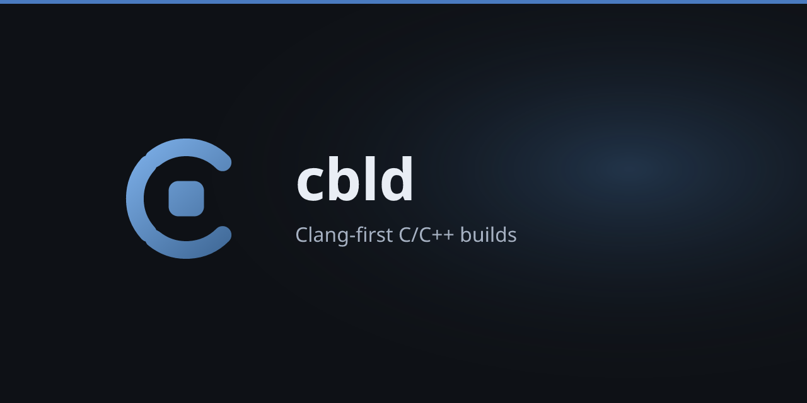

> [!IMPORTANT]
> **This project is archived.** It is no longer maintained and will not
> receive updates. The code stays available and works as documented.

<p align="center">
  
</p>

# Cbld

A build system for C and C++ projects with a fixed `src/` layout and Clang integration.

[](https://cbld.pages.dev)
[](#)

## Features

- Builds C/C++ with Clang (compile driver can fall back to gcc, tcc, zig cc), including package-local C++20 modules.
- Cross-compilation with `--target` and optional `[target.<triple>] sysroot` presets.
- Strict package layout (`cbld.toml`, `src/`, optional `include/`).
- Git dependencies with `cbld.lock` (including transitives); overlay recipes for a few upstream trees that have no `cbld.toml`; `compile_commands.json` on every build.
- `build`, `run`, `test`, `bench`, `init`, `check`, `fmt`, `lint`, `update`, `sync`, `migrate`, `vendor`, `doctor`, `completions`.

## Quick Start

### Installation

```bash
curl -fsSL https://cbld.pages.dev/install.sh | sh
```

Windows:

```powershell
Invoke-Expression (Invoke-WebRequest -Uri "https://cbld.pages.dev/install.ps1" -UseBasicParsing).Content
```

### Usage

```bash
cbld init
cbld build
cbld run
cbld test
cbld bench --release
cbld fmt --check
cbld lint --deny-warnings
cbld check
cbld update
```

## Documentation

[https://cbld.pages.dev](https://cbld.pages.dev)

## License

MIT
