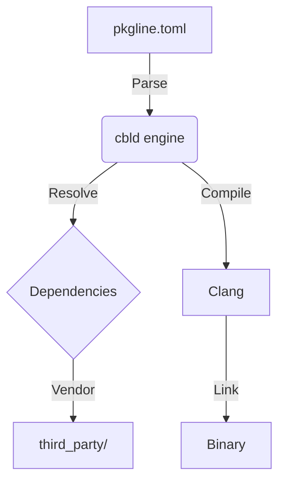

# Overview

cbld is a build engine for C and C++. It reads a `pkgline.toml` manifest, resolves dependencies, and drives Clang to compile your code. No Makefiles, no CMake scripts.

## Why cbld?

- **Declarative:** Your project is defined by a TOML file. No build scripts.
- **Strict:** Enforces project layout and compiler warnings. No implicit includes.
- **Vendored deps:** Dependencies live in `third_party/`. No system-wide installs.
- **Clang-first:** Uses LLVM/Clang under the hood for consistent behavior.

## Architecture

