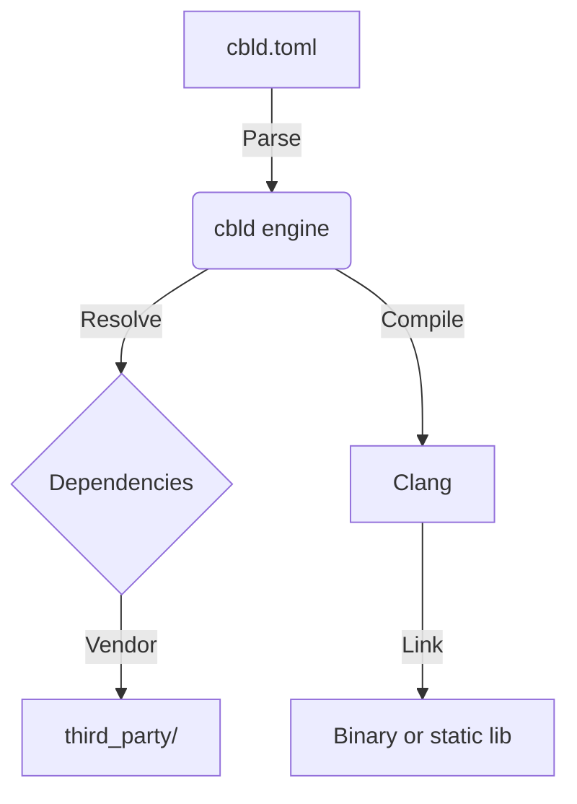

# Overview

cbld is a build engine for C and C++. It reads a `cbld.toml` manifest, resolves Git dependencies, and drives Clang to compile your code.

## Why cbld?

- **Declarative:** Your project is defined by a TOML file at the repo root.
- **Strict layout:** Sources live under `src/` (configurable); public headers under `include/` when present.
- **Vendored deps:** `cbld vendor` copies dependencies into `third_party/` for offline builds.
- **Clang-first:** Uses LLVM/Clang under the hood for consistent behavior across platforms.

## Architecture

## Package index

`cbld sync` downloads a flat-text shorthand → URL map into `~/.cbld/cbld-libs`. There is **no public registry yet** — set `CBLD_LIBS_URL` when you host an index file (see `registry/cbld-libs` in the repo). Built-in `gh:user/repo` shorthands still resolve without syncing.
