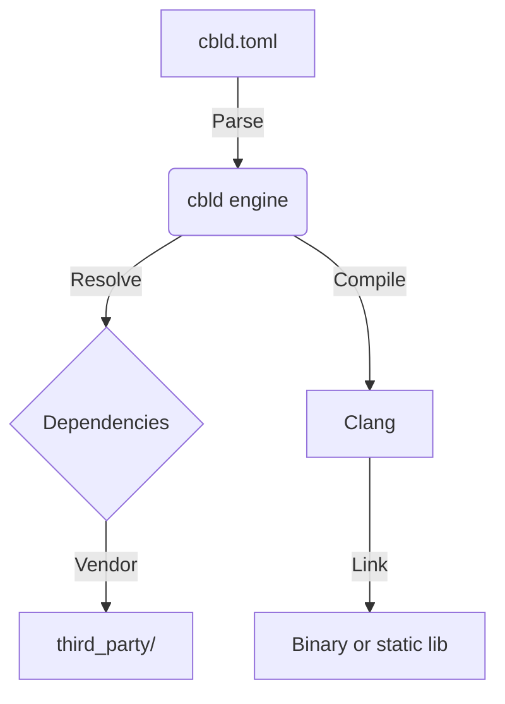

# Overview

cbld is a build engine for C and C++. It reads a `cbld.toml` manifest, resolves Git dependencies, and drives Clang to compile your code.

## Why cbld?

- **Declarative:** Your project is defined by a TOML file at the repo root.
- **Strict layout:** Sources live under `src/` (configurable); public headers under `include/` when present.
- **Vendored deps:** `cbld vendor` copies dependencies into `third_party/` for offline builds.
- **Clang-first:** Uses LLVM/Clang under the hood for consistent behavior across platforms.

## Architecture

## Package index

`gh:owner/repo` clones GitHub directly. A short list of upstream trees has overlay recipes in the binary — see [Packages](/packages). Clone as-is; a `cbld.toml` in the clone always wins.

`cbld sync` downloads the official [`iamvxrn/cbld` registry](https://github.com/iamvxrn/cbld/blob/main/registry/cbld-libs.toml) into `~/.cbld/cbld-libs` (TOML recipes or legacy `shorthand <url>` lines). `cbld doctor` refreshes it automatically. Set `CBLD_LIBS_URL` to use a private or forked index. See [architecture](/architecture).
